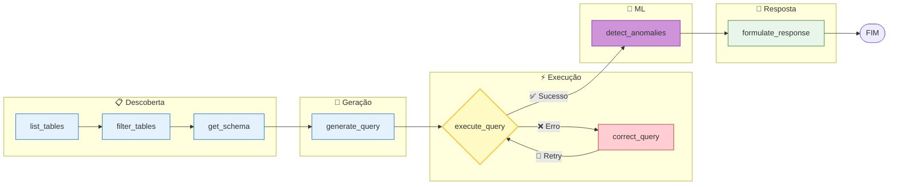
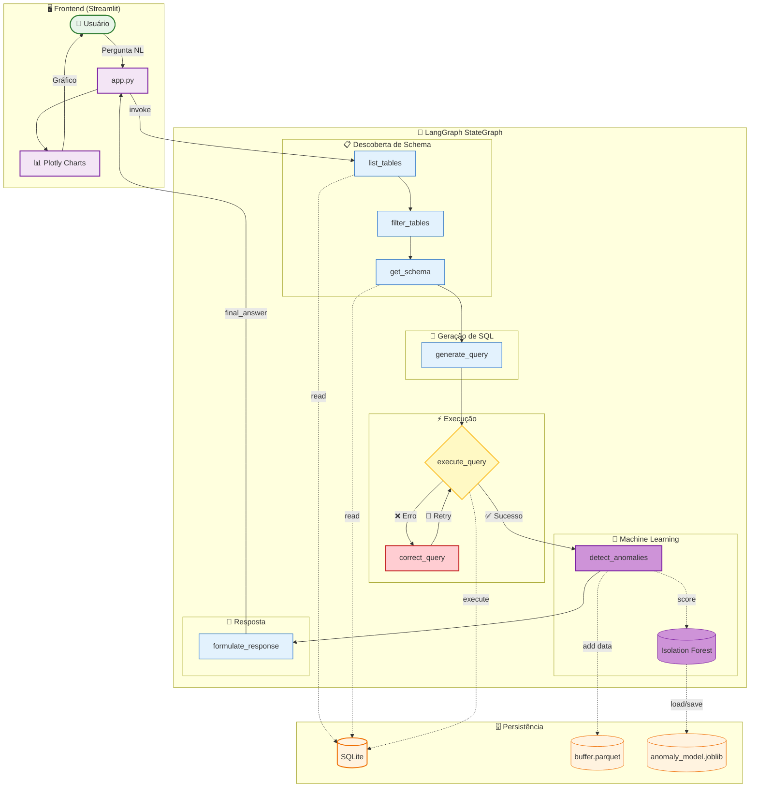

# Decisões de Arquitetura e Design

> Documento técnico do sistema **Assistente Virtual de Dados com Detecção de Anomalias**  
> Versão: 2.0 | Data: Fevereiro 2026

---

## 📋 Índice

1. [Visão Geral do Sistema](#visão-geral-do-sistema)
2. [Decisões Arquiteturais](#decisões-arquiteturais)
3. [Estrutura de Diretórios](#estrutura-de-diretórios)
4. [Componentes do Sistema](#componentes-do-sistema)
5. [Fluxo de Dados](#fluxo-de-dados)
6. [Trade-offs e Justificativas](#trade-offs-e-justificativas)

---

## 1. Visão Geral do Sistema

### O Problema
Usuários não-técnicos precisam consultar bancos de dados SQL, mas não possuem conhecimento técnico para escrever queries. Soluções existentes (RAG simples, Chains lineares) são frágeis e falham silenciosamente quando o LLM "alucina" SQL inválido.

### A Solução
Um **Agente Autônomo** baseado em LangGraph que:
1. Converte linguagem natural em SQL
2. **Auto-corrige** erros de execução
3. **Detecta anomalias** nos dados via Machine Learning
4. Apresenta resultados com visualizações inteligentes

### Por que um Agente e não uma Chain?

| Aspecto | Chain Linear | Agente (LangGraph) |
|---------|-------------|-------------------|
| Tratamento de erros | Falha e para | Loop de correção automático |
| Controle de contexto | Envia tudo ao LLM | Filtra tabelas relevantes |
| Extensibilidade | Rígida | Novos nós são plugáveis |
| Observabilidade | Difícil | Estado explícito em cada nó |

---

## 2. Decisões Arquiteturais

### 2.1 LangGraph vs LangChain tradicional

**Decisão:** Usar `StateGraph` do LangGraph em vez de `LLMChain` ou `AgentExecutor`.

**Justificativa:**
- **Loops condicionais:** Permite retry automático em caso de erro SQL
- **Estado tipado:** `SQLAgentState` com `TypedDict` dá type-safety
- **Visualização:** O grafo pode ser exportado como Mermaid para documentação
- **Debugging:** Cada nó emite `steps` que são exibidos na UI

### 2.2 Padrão Singleton para Recursos Compartilhados

**Decisão:** Usar singletons com cache para `Database`, `AnomalyDetector` e `DataBuffer`.

**Justificativa:**
```python
# Exemplo: src/database/connection.py
_db_instance = None

def get_database():
    global _db_instance
    if _db_instance is None:
        _db_instance = SQLDatabase.from_uri(...)
    return _db_instance
```

- **Performance:** Evita reconexão a cada request
- **Consistência:** Garante que todos os nós usam a mesma instância
- **Thread-safety:** O buffer usa `threading.Lock()` para operações concorrentes

### 2.3 Estratégia "Fail-Soft" para ML

**Decisão:** O módulo de ML nunca deve bloquear o fluxo principal.

**Justificativa:**
- Se o modelo não estiver treinado → retorna score 0 (dados normais)
- Se a inferência falhar → captura exceção e continua
- Se o buffer falhar → operação silenciosa

```python
# src/agent/sql_agent.py - detect_anomalies()
try:
    result = detector.detect(df)
except Exception as e:
    # Fail-soft: Don't block the pipeline
    return {"anomaly_score": 0.0, "is_anomalous": False, ...}
```

### 2.4 Isolation Forest para Detecção de Anomalias

**Decisão:** Usar `IsolationForest` do scikit-learn.

**Alternativas consideradas:**
| Algoritmo | Prós | Contras |
|-----------|------|---------|
| Isolation Forest ✓ | Sem supervisão, escalável, rápido | Não suporta partial_fit |
| Local Outlier Factor | Detecta anomalias locais | Lento para grandes datasets |
| One-Class SVM | Robusto | Muito lento para treinar |
| Autoencoders | Aprende padrões complexos | Overfitting, requer GPU |

**Por que Isolation Forest?**
1. **Sem labels:** Anomalias são raras e desconhecidas a priori
2. **Performance:** O(n log n) para treino
3. **Interpretabilidade:** Score negativo = mais anômalo

### 2.5 Buffer de Janela Deslizante (Sliding Window)

**Decisão:** Acumular dados em buffer Parquet de tamanho fixo (10.000 registros).

**Justificativa:**
- **Data Drift:** Dados antigos perdem relevância
- **Memória:** Limite fixo evita crescimento infinito
- **Persistência:** Parquet sobrevive a reinicializações
- **Eficiência:** Formato colunar otimizado para treino

```python
# Evição FIFO quando cheio
if len(self._buffer) + len(df) > Config.BUFFER_SIZE:
    excess = len(self._buffer) + len(df) - Config.BUFFER_SIZE
    self._buffer = self._buffer.iloc[excess:]
```

### 2.6 Warm-up Strategy (Treinamento Manual Inicial)

**Decisão:** Primeiro treinamento é disparado manualmente via UI.

**Alternativas:**
| Estratégia | Prós | Contras |
|------------|------|---------|
| Auto-train ao atingir N registros | Automático | Pode treinar com dados ruins |
| Train on startup | Rápido | Sem dados iniciais |
| **Manual via UI** ✓ | Usuário valida dados | Requer interação |

**Razão:** Em ambiente real, é importante que o operador valide que os dados acumulados são representativos antes do primeiro treino.

---

## 3. Estrutura de Diretórios
### Estrutura em Text

```
assistente-virtual-dados/
│
├── app.py                      # [FRONTEND] Entry point Streamlit
├── requirements.txt            # Dependências Python
├── .env                        # Variáveis de ambiente (API keys)
├── anexo_desafio_1.db          # Banco SQLite de exemplo
│
├── data/                       # [PERSISTÊNCIA ML]
│   ├── models/                 # Modelos treinados (.joblib) 
|   |   |                       # (Suporte ao processamento paralalo e serialização 
|   |   |                           dos objetos)
│   │   └── anomaly_model.joblib
│   └── buffer/                 # Buffer de dados para treino
│       └── buffer.parquet
│
└── src/                        # [CÓDIGO FONTE]
    │
    ├── config.py               # Configurações centralizadas
    │
    ├── agent/                  # [CORE] Módulo do Agente SQL
    │   ├── __init__.py
    │   ├── sql_agent.py        # Grafo LangGraph (nós + edges)
    │   ├── prompts.py          # Prompts de sistema
    │   └── llm.py              # Factory de LLMs
    │
    ├── database/               # [INFRA] Acesso a dados
    │   ├── __init__.py
    │   └── connection.py       # Singleton de conexão SQLite
    │
    ├── visualization/          # [OUTPUT] Geração de gráficos
    │   ├── __init__.py
    │   └── charts.py           # Plotly + heurísticas
    │
    └── ml/                     # [ML] Detecção de Anomalias
        ├── __init__.py
        ├── anomaly_detector.py # Wrapper Isolation Forest
        ├── data_buffer.py      # Sliding Window Buffer
        └── model_manager.py    # Ciclo de vida do modelo
```

---

## 4. Componentes do Sistema

### 4.1 Frontend (`app.py`)

| Função | Responsabilidade |
|--------|------------------|
| `init_session_state()` | Inicializa variáveis de sessão Streamlit |
| `render_sidebar()` | Menu lateral: config, exemplos, **ML controls** |
| `render_chat_history()` | Exibe histórico com badges de anomalia |
| `process_question()` | Orquestra chamada ao agente e exibe resultado |
| `main()` | Entry point da aplicação |

**Decisão de UI:** O buffer visualizer foi colocado na sidebar para não poluir a área de chat, mas mantendo visibilidade constante do status do ML.

### 4.2 Configuração (`src/config.py`)

```python
class Config:
    # LLM
    LLM_PROVIDER: str = os.getenv("LLM_PROVIDER", "openai")
    OPENAI_API_KEY: str = os.getenv("OPENAI_API_KEY", "")
    GOOGLE_API_KEY: str = os.getenv("GOOGLE_API_KEY", "")
    
    # Database
    DATABASE_PATH: str = os.getenv("DATABASE_PATH", "./anexo_desafio_1.db")
    
    # ML - Anomaly Detection
    ANOMALY_THRESHOLD: float = -0.5  # Score abaixo = anomalia
    MODEL_PATH: str = "./data/models/anomaly_model.joblib"
    BUFFER_SIZE: int = 10000
    CONTAMINATION_RATE: float = 0.05  # 5% esperado
```

**Decisão:** Todas as configs são centralizadas e podem ser sobrescritas via `.env`.

### 4.3 Agente SQL (`src/agent/sql_agent.py`)

#### Nós do Grafo



| Nó | Input | Output | Descrição |
|----|-------|--------|-----------|
| `list_tables` | - | `tables[]` | Lista tabelas do banco |
| `filter_tables` | `tables[]` | `tables[]` (filtrado) | LLM seleciona tabelas relevantes |
| `get_schema` | `tables[]` | `schema` | Carrega DDL das tabelas |
| `generate_query` | `schema`, `question` | `query` | LLM gera SQL |
| `execute_query` | `query` | `query_result` ou `error` | Executa no SQLite |
| `correct_query` | `error`, `query` | `query` (corrigida) | LLM corrige baseado no erro |
| `detect_anomalies` | `query_result` | `anomaly_score`, `is_anomalous` | ML detecta outliers |
| `formulate_response` | `query_result`, `is_anomalous` | `final_answer` | LLM formula resposta |

#### Estado do Agente (`SQLAgentState`)

```python
class SQLAgentState(TypedDict):
    question: str           # Pergunta original
    tables: list[str]       # Tabelas selecionadas
    schema: str             # DDL das tabelas
    query: str              # SQL gerada
    query_result: str       # Resultado da execução
    error: str              # Erro (se houver)
    retry_count: int        # Contador de retries
    final_answer: str       # Resposta final
    steps: Annotated[list[str], add]  # Log de passos
    llm_provider: str       # Provider atual
    # Campos ML
    anomaly_score: float    # Score do Isolation Forest
    is_anomalous: bool      # True se score < threshold
    anomaly_details: str    # Descrição textual
```

#### Função de Roteamento

```python
def should_retry(state) -> Literal["correct", "respond"]:
    if state.get("error") and state.get("retry_count") < 3:
        return "correct"  # Vai para correção
    return "respond"      # Vai para detecção de anomalia
```

### 4.4 Prompts (`src/agent/prompts.py`)

| Prompt | Uso | Técnica |
|--------|-----|---------|
| `TABLE_SELECTION_PROMPT` | Filtrar tabelas | Few-shot com formato CSV |
| `QUERY_GENERATION_PROMPT` | Gerar SQL | Schema injection + regras |
| `QUERY_CORRECTION_PROMPT` | Corrigir SQL | Error injection |
| `RESPONSE_GENERATION_PROMPT` | Formular resposta | Resultado como contexto |
| `ANOMALY_WARNING_PROMPT` | Alerta de anomalia | Instrução de formatação |

**Decisão:** Prompts são templates separados para facilitar iteração e A/B testing.

### 4.5 LLM Factory (`src/agent/llm.py`)

```python
def get_llm(provider: str = None):
    provider = provider or Config.LLM_PROVIDER
    if provider == "openai":
        return ChatOpenAI(model="gpt-4o-mini", ...)
    elif provider == "gemini":
        return ChatGoogleGenerativeAI(model="gemini-2.5-flash", ...)
```

**Decisão:** Factory pattern permite trocar providers sem alterar código do agente.

### 4.6 Conexão ao Banco (`src/database/connection.py`)

| Função | Responsabilidade |
|--------|------------------|
| `get_database()` | Retorna singleton `SQLDatabase` |
| `get_db_info()` | Retorna dict com tabelas e schema (para UI) |

**Decisão:** Usar `langchain_community.utilities.SQLDatabase` para compatibilidade com o ecossistema LangChain.

### 4.7 Visualização (`src/visualization/charts.py`)

| Função | Responsabilidade |
|--------|------------------|
| `display_data()` | Entry point: decide tipo de visualização |
| `detect_visualization_type()` | Heurística para escolher gráfico |
| `try_create_bar_chart()` | Gráfico de barras (até 15 itens) |
| `try_create_pie_chart()` | Gráfico de pizza (até 6 itens) |
| `try_create_line_chart()` | Gráfico de linha (séries temporais) |
| `try_create_histogram()` | Histograma (distribuições) |

**Heurísticas de decisão:**
1. Se tem coluna de data + numérico → **Linha**
2. Se tem categórico + numérico (≤15 categorias) → **Barras**
3. Se tem categórico + numérico (≤6 categorias) → **Pizza**
4. Se tem apenas numérico → **Histograma**
5. Fallback → **Tabela**

### 4.8 Detector de Anomalias (`src/ml/anomaly_detector.py`)

```python
class AnomalyDetector:
    def __init__(self, model_path, contamination, threshold):
        self.model: IsolationForest = None
        self._load_model()  # Tenta carregar modelo persistido
    
    def detect(self, df: pd.DataFrame) -> dict:
        # 1. Extrai features numéricas
        # 2. Normaliza com StandardScaler
        # 3. Calcula score via decision_function()
        # 4. Retorna {"score": float, "is_anomalous": bool, ...}
    
    def train(self, df: pd.DataFrame) -> bool:
        # 1. Valida dados de entrada
        # 2. Treina IsolationForest
        # 3. Persiste modelo atomicamente (.joblib)
```

**Decisão de normalização:** `StandardScaler` aplicado antes da inferência para garantir que features em escalas diferentes tenham peso igual.

### 4.9 Buffer de Dados (`src/ml/data_buffer.py`)

```python
class SlidingWindowBuffer:
    def __init__(self, buffer_path, max_size):
        self._buffer: pd.DataFrame = pd.DataFrame()
        self._lock = threading.Lock()  # Thread-safety
        self._load()  # Carrega buffer persistido
    
    def add(self, df: pd.DataFrame):
        # 1. Concatena ao buffer existente
        # 2. Se excedeu max_size, remove registros antigos (FIFO)
        # 3. Persiste em Parquet
    
    def get_training_data(self) -> pd.DataFrame:
        return self._buffer.copy()
    
    def size(self) -> int:
        return len(self._buffer)
```

**Decisão de persistência:** Parquet foi escolhido sobre CSV por:
- Tipagem de colunas preservada
- Compressão nativa
- Leitura parcial eficiente

### 4.10 Model Manager (`src/ml/model_manager.py`)

```python
class ModelManager:
    def __init__(self, detector, buffer, retrain_interval):
        self._query_count = 0
        self._last_train_time = None
    
    def retrain_if_needed(self) -> bool:
        # Retreina se:
        # 1. Nunca treinou E buffer > 100 registros
        # 2. Passou retrain_interval queries desde último treino
        # 3. Passou X horas desde último treino
```

**Decisão:** Re-treinamento automático desabilitado por padrão. Botão manual na UI dá controle ao operador.

---

## 5. Fluxo de Dados

### Diagrama Mermaid do Pipeline



### Diagrama ASCII (Alternativo)

```
┌─────────────┐     ┌─────────────────────────────────────────────────────────────────┐
│   Usuário   │     │                        LangGraph StateGraph                      │
│  (Browser)  │     │                                                                    │
└──────┬──────┘     │  ┌──────────┐    ┌──────────┐    ┌──────────┐    ┌──────────┐    │
       │            │  │  list    │───▶│  filter  │───▶│   get    │───▶│ generate │    │
       │            │  │ tables   │    │  tables  │    │  schema  │    │  query   │    │
       ▼            │  └──────────┘    └──────────┘    └──────────┘    └────┬─────┘    │
  ┌─────────┐      │                                                        │          │
  │Streamlit│◀─────┼────────────────────────────────────────────────────────┤          │
  │   UI    │      │                                                        ▼          │
  └────┬────┘      │                    ┌──────────┐    ┌──────────┐    ┌──────────┐   │
       │           │                    │  correct │◀───│  execute │◀───│  query   │   │
       │           │                    │  query   │    │  query   │    │ (retry?) │   │
       │           │                    └──────────┘    └────┬─────┘    └──────────┘   │
       │           │                                         │ sucesso                  │
       │           │                                         ▼                          │
       │           │  ┌──────────┐    ┌──────────┐    ┌──────────┐                     │
       │           │  │formulate │◀───│  detect  │◀───│ ML Score │                     │
       │           │  │ response │    │ anomalies│    └──────────┘                     │
       │           │  └────┬─────┘    └──────────┘                                      │
       │           │       │                                                            │
       │           └───────┼────────────────────────────────────────────────────────────┘
       │                   │
       │                   ▼
       │           ┌──────────────┐
       └──────────▶│   Plotly     │──────▶ Gráfico/Tabela
                   │ Visualization│
                   └──────────────┘
```

---

## 6. Trade-offs e Justificativas

### 6.1 Por que não usar RAG para o schema?

**Problema:** Embedding de schemas SQL tem semântica pobre.

**Solução:** Filtrar tabelas via LLM (`filter_tables` node) é mais preciso e custa poucos tokens.

### 6.2 Por que Parquet e não SQLite para o buffer?

| Aspecto | SQLite | Parquet |
|---------|--------|---------|
| Append performance | Ruim (índices) | Excelente |
| Tipagem | Fraca | Forte |
| Tamanho | Maior | Comprimido |
| Dependência | Já existe no projeto | Nova (pyarrow) |

**Decisão:** Parquet escolhido por performance de append e tipagem forte, essenciais para dados de treino ML.

### 6.3 Por que threshold fixo e não percentil adaptativo?

**Trade-off:** Simplicidade vs. Adaptabilidade

Threshold fixo (`-0.5`) é mais fácil de explicar e debugar. Em produção, um threshold adaptativo (percentil 5 do training set) seria mais robusto.

### 6.4 Por que não usar streaming para respostas LLM?

**Decisão:** Respostas não-streaming.

**Justificativa:** O fluxo do agente precisa do resultado completo da query antes de formular a resposta. Streaming parcial causaria problemas no grafo.

### 6.5 Por que não persistir histórico de chat?

**Decisão:** Histórico apenas em `st.session_state` (memória).

**Justificativa:** Escopo do desafio. Em produção, seria adicionado:
- PostgreSQL/Redis para histórico
- User sessions com autenticação
- Rate limiting por usuário

---

## Conclusão

O sistema possui uma arquitetura moderna de **Agente de IA** com:

1. **Resiliência:** Auto-correção de erros SQL
2. **Eficiência:** Otimização de contexto via filtro de tabelas
3. **Inteligência:** Detecção de anomalias via ML
4. **Extensibilidade:** Grafo plug-and-play para novos nós
5. **Observabilidade:** Estado explícito e passos transparentes na UI

As decisões foram tomadas priorizando:
- **Robustez** sobre performance
- **Simplicidade** sobre flexibilidade prematura
- **Fail-soft** sobre fail-fast para componentes não-críticos (ML)
